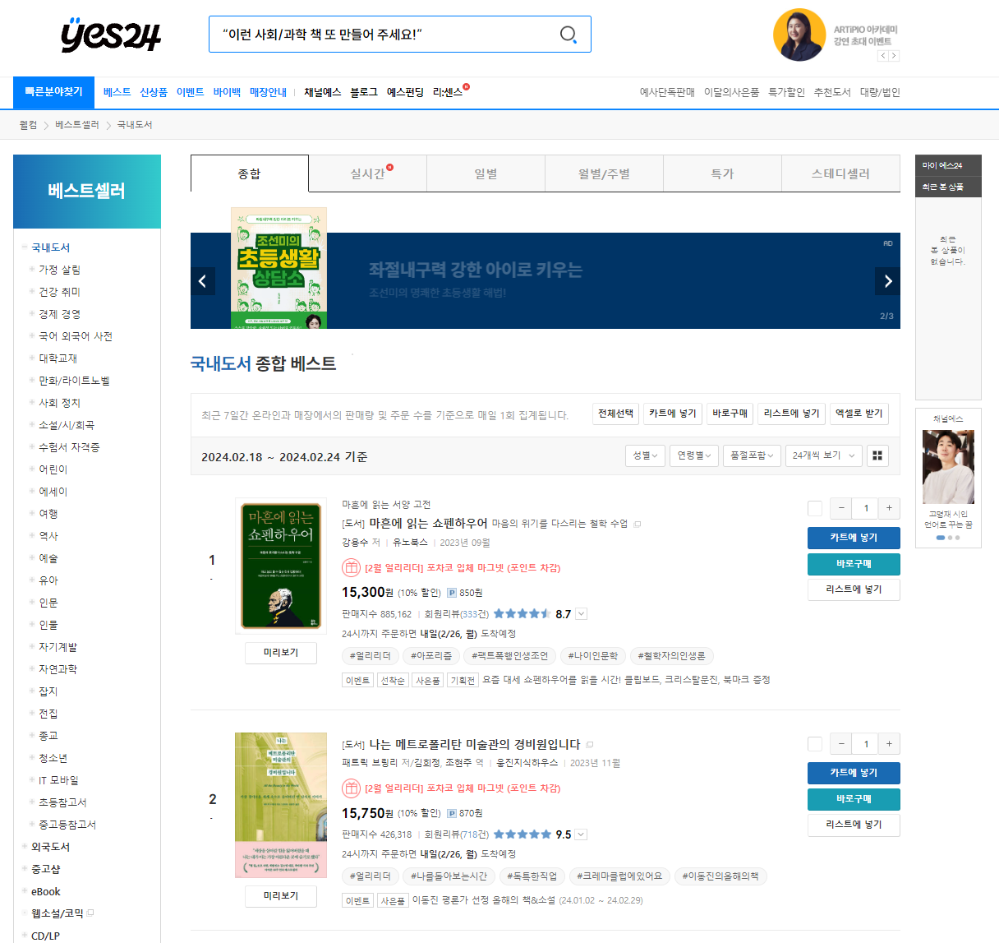
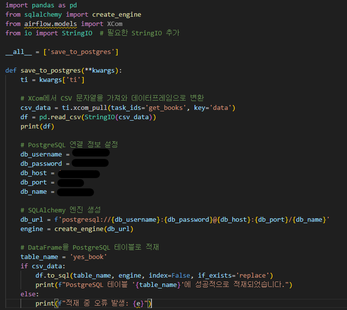
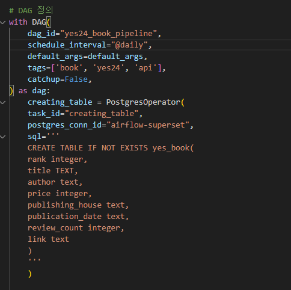
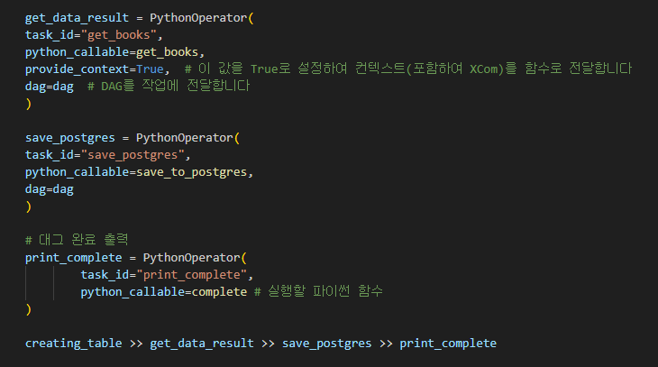
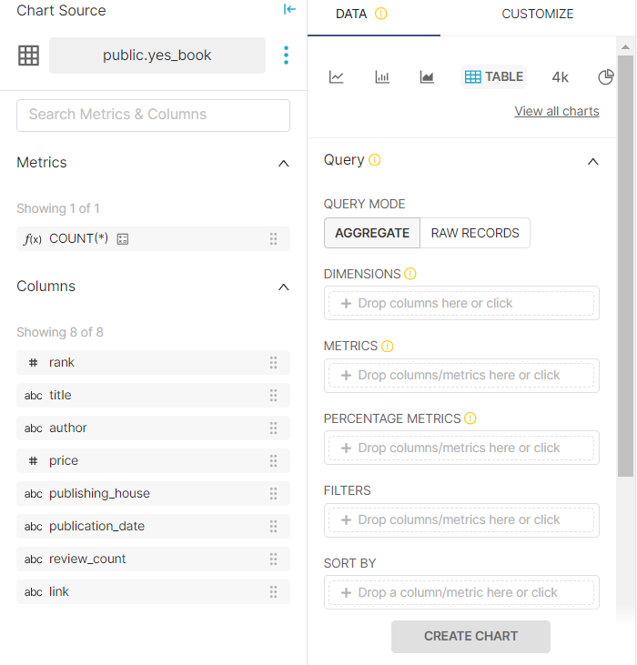
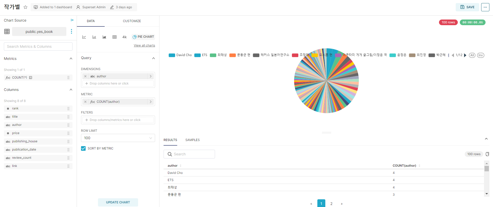

# YES24 베스트셀러 데이터 ETL 자동화

작업기간: 2024년 2월 27일 → 2024년 3월 6일
사용 기술 스택: Airflow, PostgreSQL, Python, Superset
작업 영역: Airflow, 시각화, 웹 크롤링, 코딩
사용 데이터: Yes24 베스트셀러
설명: 매일 베스트셀러 데이터를 추출, 변환, 저장하여 데이터의 주요 정보를 시각화하는 자동화 프로세스

### 프로젝트 원본 및 참고

[[Airflow] Yes24 Best 200 책 정보 수집 & Superset으로 일별 모니터링 대시보드 구축](https://blog.naver.com/rlxk751/223199835658)

[https://blog.naver.com/rlxk751/223199835658](https://blog.naver.com/rlxk751/223199835658)

# ✅ 개요

<aside>
💡 **사용 기술 스택
- 🐧Linux
- 🐳Docker
- 🌬️Airflow
- 🗃️PostgreSQL
- 📥BeautifulSoup
- 🐼Pandas**

</aside>



- **도서 판매 웹사이트인 YES24의 베스트셀러 데이터를 웹 크롤링하고, 크롤링한 데이터를 테이블 형태로 변환, DBMS에 저장, 시각화 하는 ETL 프로세스**

- Docker 이미지 빌드
    
    ```bash
    **# Superset**
    docker build --no-cache  -t superset:latest .
    ```
    
    ```bash
    **# Apache Airflow 공식 Document의 docker-compose.yaml 로드**
    cd airflow
    docker-compose build
    docker-compose up
    ```
    

# 🛠️ Extract(추출)

<aside>
💡 **사용 기술 스택
- 📥BeautifulSoup**

</aside>


- HTML 코드의 각 클래스를 참조해 필요한 제목, 저자, 가격 등의 데이터 크롤링

## 🕸️크롤링 과정


# 🔄 Transform(변환)

<aside>
💡 **사용 기술 스택
- 🐼Pandas**

</aside>


- 크롤링한 데이터를 테이블 형태로 변환

# 💾 Load(저장)

<aside>
💡 **사용 기술 스택
- 🐧Linux
- 🐳Docker
- 🗃️PostgreSQL**

</aside>



- Load한 테이블 컨테이너 내부에서 확인
    
    ```bash
    $ docker exec -it airflow-postgres-1 bash
    $ psql -U airflow
    $ SELECT rank, title, author, price FROM yes_book;
    ```
    
    
    

# **🌬️ Airflow Dag**

<aside>
💡 **테이블 생성 - 웹 크롤링 - DB 저장 - 완료 메시지 출력 순으로 함수 실행 자동화**

</aside>





<aside>
💡 **생성된 Airflow 파이프라인**
실행 여부, 로그, 다음 실행 시간 등을 모니터링 할 수 있다.

</aside>


# 📊 Superset(데이터 시각화)

<aside>
💡 각종 열과 행, 매트릭스로 다양한 차트를 시각화한다.

</aside>





- 도서 데이터를 저자별로 파이로 시각화한 예시 차트